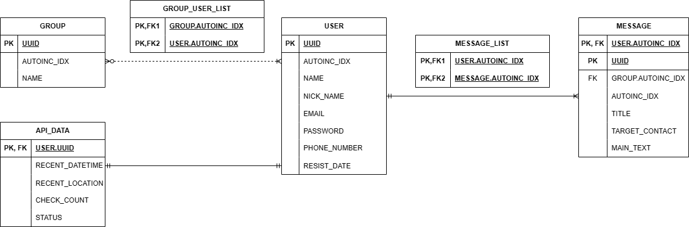

# DB

## ERD

## 사용자  

+ 요구사항

    |번호|내용|
    |:---:|:---:|
    |A-A-01|메세지를 작성하려면 회원가입을 해야한다.
    |A-A-02|회원 가입시 사용자명, 이메일, 비밀번호, 전화번호를 입력해야한다.
    |A-A-03|회원은 가입시 랜덤UUID를 가지며 변경할 수 없다.
    |A-A-04|회원 가입시 전화번호 인증을 진행해야 한다.
    |A-A-05|회원 가입이 완료되면 가입일시를 서버 시간 기준으로 기입한다.
    |A-A-06|사용자는 그룹에 가입할 수 있다.
    |A-A-07|사용자는 그룹별 메시지를 작성 할 수 있다.
    |A-A-08|사용자는 하나 이상의 메세지를 작성해야 한다.
    |A-A-11|사용자는 인덱스 값을 가지며 사용자가 생성 될 때 자동으로 증가한다.

+ 도메인

    |번호|속성명|내용|
    |:---:|:---:|:---:|
    |A-B-01|UUID|서버에서 랜덤 UUID를 생성하여 할당한다.
    |A-B-02|AUTOINC_ID|데이터베이스에서 자동 증가하는 정수 인덱스 값으로 DB에서 관리한다.
    |A-B-02|사용자명|사용자명 길이는 2~5자로 하며 공백을 포함할 수 없다.
    |A-B-03|별명|2~10자로 제한하며 공백 및 비속어를 포함할 수 없다.
    |A-B-04|이메일|정규식을 통해 검증하여 통과하면 유효한 주소로 판단한다.
    |A-B-05|비밀번호|비밀번호 길이는 8~12자로 제한하며 영어 대,소문자, 숫자, 특수문자를 포함한다.
    |A-B-06|전화번호|전화번호는 하이픈으로 구분하며 첫번째 부분은 "010"만 입력가능하며 두 번째 부분은 3     또는 4자리의 연속된 숫자만 가능하고 세 번째 부분은 4자리의 연속된 숫자만 가능하다.

-------------

## API 정보

+ 요구사항

    |번호|내용|
    |:---:|:---:|
    |B-A-01|API 정보는 사용자의 UUID를 사용하여 사용자와 연결한다.
    |B-A-02|사용자는 하루 24번 중 10번 이상 접속 인증을 해야한다.
    |B-A-03|사용자의 최근인증시간은 마지막으로 접속인증을 한 서버시간을 기준으로 기입한다.
    |B-A-04|사용자의 최근위치는 마지막 접속인증을 한 GPS 또는 IP기반 위치를 기입한다.
    |B-A-05|사용자 접속 인증 수에 따라 사용자 상태를 변경한다.
    |B-A-06|마지막 인증시간으로 부터 3일이 지나면 작성된 메세지를 지정된 연락처로 전송한다.

+ 도메인

    |번호|속성명|내용|
    |:---:|:---:|:---:|
    |B-B-01|인증 수|0~23 사이의 정수만 가능하며 값은 1씩 증가한다. 날짜가 바뀔경우 0으로 초기화 된다.
    |B-B-02|최근인증시간|datetime 형태로 저장한다.
    |B-B-03|최근위치"위도|경도"로 구분되는 문자열로 저장한다.
    |B-B-04|상태|전날의 인증 수 에 따라서 23~10은 "정상" 9~6은 "주의", 5~0은 "경고"로 표시한다.

## 그룹

+ 요구사항

    |번호|내용|
    |:---:|:---:|
    |C-A-01|그룹 생성시 이름을 입력해야 한다.
    |C-A-02|그룹명은 비속어를 포함할 수 없다.
    |C-A-02|그룹은 생성시 랜덤 UUID를 가지며 변경할 수 없다.
    |C-A-03|그룹에는 1명이상의 회원이 존재해야 한다.
    |C-A-04|그룹에 속한 회원이 0명이 되면 자동으로 그룹이 제거 된다.
    |C-A-05|그룹원은 회원의 인덱스값으로 관리된다.
    |C-A-06|그룹은 인덱스 값을 가지며 그룹이 생성 될 때 자동으로 증가한다.

+ 도메인

    |번호|속성명|내용|
    |:---:|:---:|:---:|
    |C-B-01|UUID|서버에서 랜덤 UUID를 생성하여 할당한다.
    |C-B-02|AUTOINC_ID|데이터베이스에서 자동 증가하는 정수 인덱스 값으로 DB에서 관리한다.
    |C-B-03|그룹명|그룹명 길이는 공백을 포함하여 2~12글자로한다. 공백만 존재할 수 없다.
    |C-B-04|회원명단|DB에서 관리되는 인덱스 정수값만 저장될 수 있다.

### 메세지

+ 요구사항

    |번호|내용|
    |:---:|:---:|
    |D-A-01|메세지는 생성시 랜덤 UUID를 가지며 변경할 수 없다.
    |D-A-02|메세지 작성시 제목, 전송 대상 연락처, 본문을 입력해야 한다.
    |D-A-03|메세지는 속해있는 그룹 단위로 전송 할 수 있다.

+ 도메인

    |번호|속성명|내용|
    |:---:|:---:|:---:|
    |D-B-01|UUID|서버에서 랜덤 UUID를 생성하여 할당한다.
    |D-B-02|AUTOINC_ID|데이터베이스에서 자동 증가하는 정수 인덱스 값으로 DB에서 관리한다.
    |D-B-03|그룹인덱스|사용자가 속해있는 그룹의 인덱스값만 입력 가능하다.
    |D-B-04|제목|2~8자 사이의 공백없는 문자열만 가능하다.
    |D-B-05|대상연락처|전화번호 및 이메일형식만 입력할 수 있다.
    |D-B-06|본문|500자 미만의 문자열만 가능하다.